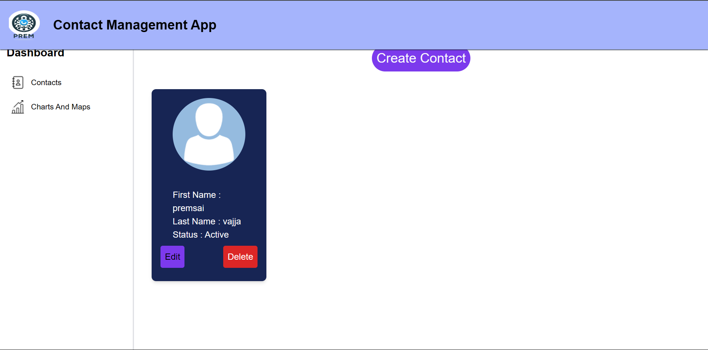

# 📝 Contact Management App with Charts and Maps 🗺️

Welcome to the **Contact Management App**! This application allows you to manage your contacts and view COVID-19 data through interactive charts and maps. Built with modern technologies like ReactJS, TypeScript, TailwindCSS, React Router v6, and React Query, this app provides a smooth and responsive user experience.

---

## 🌟 **Live Deployment** 🌟

Check out the app live [**here**](https://react-contact-management-app-ocnm-prems-projects-7f99fe25.vercel.app/). 

---

## Table of Contents

- [Features](#features)
- [Installation](#installation)
- [Usage](#usage)
- [APIs](#apis)
- [Screenshots](#screenshots)
- [License](#license)
- [Contact](#contact)

## Features

- **Contact Management:**
    - Add, view, edit, and delete contacts.
    - Uses Redux for state management.

- **Charts and Maps:**
    - Interactive map displaying country-specific COVID-19 data.
    - Line graph showing COVID-19 case fluctuations.

- **Technology Stack:**
    - ReactJS, TypeScript, TailwindCSS.
    - React Router v6 for navigation.
    - React Query (Tanstack Query) for API handling.

## Installation

To run the app locally, follow these instructions:

1. **Clone the repository:**
    ```shell
    git clone https://github.com/Vajja-Premsai/React_Contact_Management_App
    ```

2. **Navigate to the project directory:**
    ```shell
    React_Contact_Management_App
    ```

3. **Install dependencies:**
    ```shell
    npm install
    ```

4. **Start the app:**
    ```shell
    npm start
    ```

The app will be available at `http://localhost:3000`.

## Usage

- **Contacts Page:** 
    - Use the form to add new contacts.
    - View the list of contacts, edit, or delete them.

- **Charts and Maps Page:**
    - Explore the line graph for COVID-19 case fluctuations.
    - View the map for country-specific COVID-19 data.

## APIs

- World Wide Data of Cases: [**View Data**](https://disease.sh/v3/covid-19/all)
- Country-Specific Data of Cases: [**View Data**](https://disease.sh/v3/covid-19/countries)
- Graph Data for Cases with Date: [**View Data**](https://disease.sh/v3/covid-19/historical/all?lastdays=all)

## Screenshots




For more screenshots, visit the [**screenshot folder**](./screenshots/).

## License

Specify the license under which the project is available (e.g., MIT, GPL, etc.).

## Contact

For questions or feedback, you can reach out to the project maintainers:

- Email: [your-email@example.com](mailto:your-email@example.com)
- GitHub: [your-username](https://github.com/your-username)

---

Thank you for checking out the project! Let us know if you have any issues or questions.
